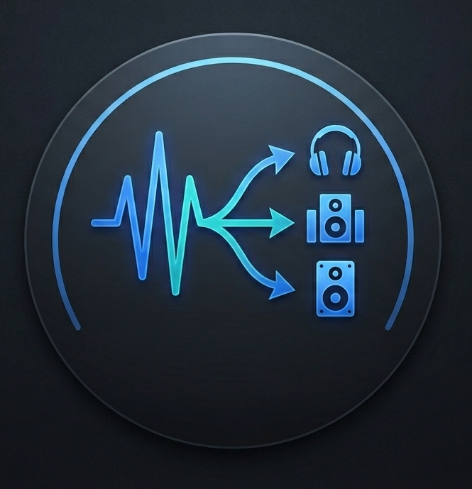

<h1 align="center" style="display: flex; align-items: center; justify-content: center; gap: 10px;">
   SoundSync
</h1>

<p align="center">
  
  
  

  
  
  
  
  
  
  
</p>


<p align="center">
  A lightweight, low-latency C# WPF application that captures your system's audio and routes it to multiple hardware output devices simultaneously. Built entirely on the Windows Core Audio API (WASAPI) using the NAudio library.
</p>

## ✨ Features

- **Multi-Endpoint Routing:** Play a single audio source (like a YouTube video or Spotify) through multiple pairs of headphones or speakers at the exact same time.
- **Aggressive Latency Control:** Implements a custom ring-buffer clearing strategy to combat hardware clock drift, ensuring secondary devices stay within ~10-30ms of real-time.
- **Anti-Feedback Loop Protection:** Automatically detects your default Windows playback device and prevents audio from being routed back into it, completely eliminating infinite echo loops.
- **Dynamic Device Scanning:** Easily refresh the device list to detect newly plugged-in USB or Bluetooth headphones without restarting the app.
- **Modern UI:** Built with Windows Presentation Foundation (WPF) featuring a sleek, dark-mode graphical interface.

## ⚙️ How it Works

The application uses `WasapiLoopbackCapture` to intercept the raw audio bytes flowing to your default Windows audio endpoint. 

When the user clicks "Connect", the app initializes a separate `WasapiOut` stream for every selected hardware device in Shared Mode. As Windows fires `DataAvailable` events containing the live audio bytes, the application aggressively broadcasts those bytes into a `BufferedWaveProvider` attached to every selected output.

## 🚀 Getting Started

### 📥 Download & Installation (For Regular Users)

You do not need to install anything to use SoundSync! 

1. Go to the [Releases Page](https://github.com/sugumar247/SoundSync/releases).
2. Download **SoundSync-Portable.exe**.
3. Double-click the file to run it. That's it!
4. If you face any issue, open the application with  "Run as Administrator".

*(Note: If you download the smaller `SoundSync-Light.exe` version, you must have the [.NET 8.0 Desktop Runtime](https://dotnet.microsoft.com/download/dotnet/8.0) installed on your PC).*

### 💻 Building from Source (For Developers)

1. Clone the repository:
   ```bash
   git clone https://github.com/sugumar247/SoundSync.git
   ```
2. Open `SoundSync.slnx` in Visual Studio 2022.
3. The project relies on the [NAudio](https://github.com/naudio/NAudio) library. Visual Studio should restore this NuGet package automatically. If not, run:
   ```bash
   dotnet restore
   ```
4. Press `F5` to compile and run the application.

## 🎧 Usage & "Perfect Sync" Tutorial

If you are trying to share a movie with a friend using two pairs of headphones, you will notice a slight ~30ms delay on the 2nd pair of headphones if you capture audio directly from the 1st pair. 

To achieve **100.00% perfect synchronization** with zero echoes, use the "Dummy Hardware" trick:

1. Look at your Windows sound settings and find an audio device you aren't currently using (e.g., an HDMI Monitor with no speakers, or a Virtual Audio Cable like *VB-Audio Cable*).
2. Set that silent device as your **Default Windows Output**. (Your computer will go silent).
3. Open **SoundSync**.
4. Check the boxes for **Headphone 1** and **Headphone 2** or more. 
5. Click **Connect**. 

The app will now capture the silent audio stream, duplicate it, and push it to *both* sets of headphones via the C# engine. Because they share the exact same routing path, their latency is identical and they are perfectly synchronized!

## 🛠️ Built With

* **C# / .NET 8.0** - The core framework
* **WPF** - UI Framework
* **[NAudio](https://github.com/naudio/NAudio)** - Audio and WASAPI interaction

## 🤝 Contributing

Contributions, issues, and feature requests are welcome! 

1. Fork the Project
2. Create your Feature Branch (`git checkout -b feature/AmazingFeature`)
3. Commit your Changes (`git commit -m 'Add some AmazingFeature'`)
4. Push to the Branch (`git push origin feature/AmazingFeature`)
5. Open a Pull Request

## 📝 License

Distributed under the MIT License. See `LICENSE` for more information.
